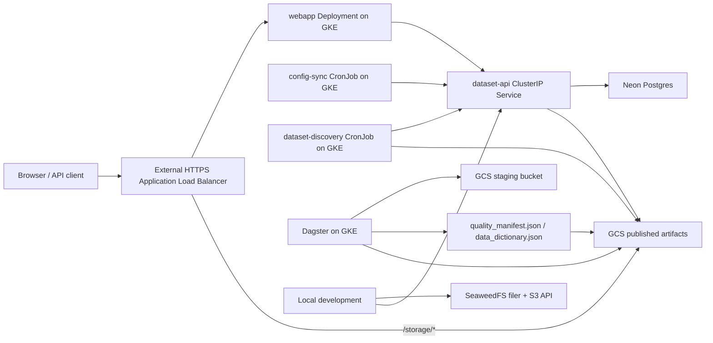

# HIFLD Next Architecture

## Current Shape

- The webapp is the public TanStack Start application and same-origin JSON API facade.
- The external Application Load Balancer sends web traffic to the GKE `webapp` Service via standalone NEGs.
- Public `/storage/*` URLs are served directly from the GCS backend bucket.
- The dataset API is internal-only in the cluster at `http://dataset-api.hifld-next.svc.cluster.local`.
- The dataset API serves catalog reads and intentionally initializes database schema on startup.
- GCS stores production dataset artifacts and catalog configuration inputs.
- SeaweedFS is the supported local object-storage backend.
- Dagster/GKE own ingestion, geospatial processing, quality computation, and promotion into published artifacts.
- Dataset quality and schema views use stored version metadata from `quality_manifest.json` and `data_dictionary.json`; the dataset API does not compute quality on request.
- GKE CronJobs own catalog config reconciliation and dataset discovery.
- Terraform in `../hifld-next-iac` manages GKE, the load balancer, buckets, IAM, secrets, Neon, and GitHub Actions identity.
- GitHub Actions in this repo builds and publishes GHCR images for `dataset-api` and `webapp`.
- GitHub Actions in `../hifld-next-iac` deploys selected GHCR image tags with Helm for `dataset-api`, `webapp`, and `dataset-discovery`.
- Runtime client settings such as PostHog are supplied by the deployer through environment variables and served by `/runtime-config.js`; they are not baked into public GHCR images.

## Removed Legacy

GeoServer is no longer part of the active runtime, local compose stack, or production Terraform path.
