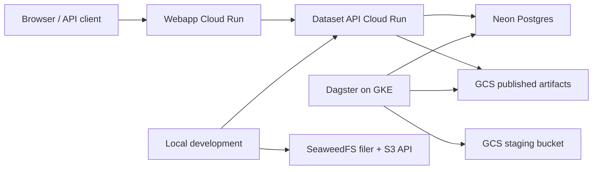

# HIFLD Next Architecture

## Current Shape

- The webapp is the public application and public JSON API facade.
- The dataset API serves catalog reads and intentionally initializes database schema on startup.
- GCS stores production dataset artifacts.
- SeaweedFS is the supported local object-storage backend.
- Dagster/GKE own ingestion, discovery, quality computation, and promotion.
- Terraform in `../hifld-next-iac` manages Cloud Run, GKE, buckets, IAM, and jobs.

## Removed Legacy

GeoServer is no longer part of the active runtime, local compose stack, or production Terraform path.
